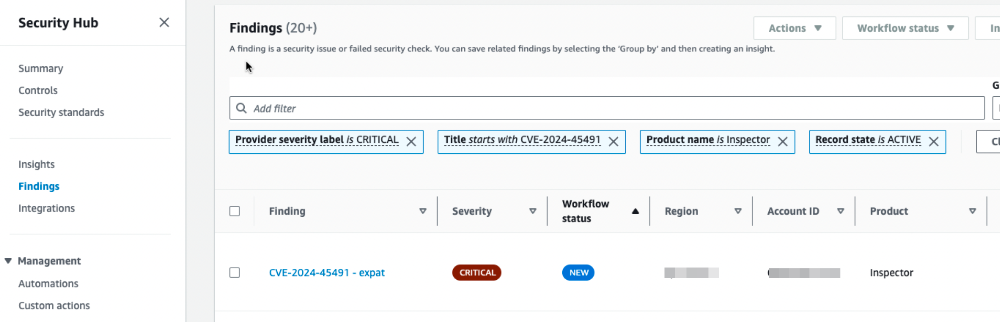
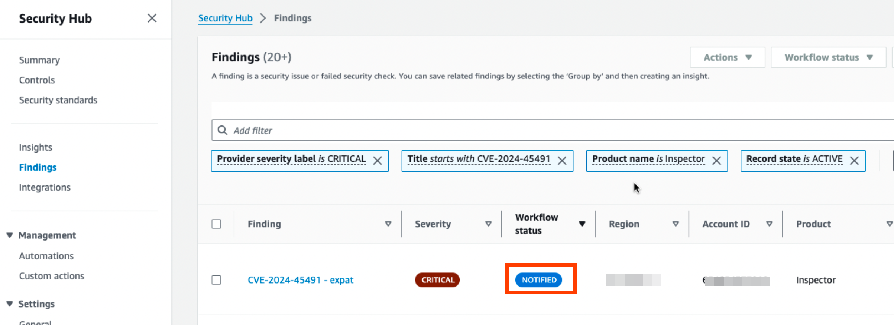

# Security Findings Exporter CDK Construct

## Overview

The `SecurityFindingsExporterCdkConstruct` is an AWS CDK construct that automates the retrieval, processing, and export of security findings from AWS Security Hub. It includes a Lambda function and all the necessary infrastructure to notify users of critical security vulnerabilities, such as those detected by Amazon Inspector, and export these findings to external systems like Jira.

The construct simplifies the process of managing security findings in AWS environments, allowing users to focus on remediating issues rather than managing complex infrastructure.

## Features

- **Automated Security Findings Retrieval**: Automatically collects critical findings from AWS Security Hub.
- **Jira Integration**: Automatically creates Jira issues for critical security findings, ensuring that the appropriate teams are notified.
- **Extensible Export Destinations**: Supports exporting security findings to other services, such as S3, DynamoDB, or external APIs.
- **Serverless and Scalable**: Built on AWS Lambda for auto-scaling and pay-per-use execution.
- **Updates the workflow of findings**: For findings in Workflow status of *NEW*, the Lambda will update to *NOTIFIED* so that the reportings are stateful with the state stored in the Security Hub itself.

From "NEW": 
To "NOTIFIED": 

## Architecture

The architecture of the `SecurityFindingsExporterCdkConstruct` is designed to be fully serverless and includes:

- **Lambda Function**: Processes security findings and creates Jira issues, using Python script with boto3.
- **IAM Roles**: Ensures that the Lambda function has the appropriate permissions based on principle of least privilege (PoLP) to access AWS Security Hub and CloudWatch logs.
- **Jira Integration**: Uses Jira's REST API to create issues based on critical security findings.

## Prerequisites

Before using this CDK construct, you need to ensure the following:

1. **AWS CDK Installed**: You need to have the AWS CDK installed. You can install it with the following command:

   ```bash
   npm install -g aws-cdk
   ```

2. **Jira Credentials**: Ensure that you have the following Jira credentials configured as environment variables:
   - `Jira_basicAuth_email`: Your Jira email for basic authentication.
   - `Jira_basicAuth_apiToken`: Your Jira API token.
   - `Jira_serverUrl`: The URL of your Jira server.
   - `Jira_projectKey`: The key of your Jira project.

3. **AWS Account**: Ensure that your AWS CLI is configured with the necessary permissions to deploy CDK resources.

## Getting Started

### Clone the Repository

```bash
git clone https://github.com/kangks/security-findings-exporter-cdk-construct.git
cd security-findings-exporter-cdk-construct
```

### Install Dependencies

Navigate to the project directory and install the necessary dependencies:

```bash
npm install
npm i @richkang/security-findings-exporter-cdk-construct
```

### Deploy the Stack

To deploy the stack to your AWS account, run the following command:

```bash
cdk deploy
```

This will deploy the `SecurityFindingsExporterCdkConstruct` and provision all necessary AWS resources, including the Lambda function and IAM roles.

### Lambda Function

The Lambda function, written in Python, is responsible for processing security findings and exporting them to Jira. You can find the Lambda function code in the `lambda/` directory. Feel free to modify the code to suit your specific needs.

### Configuration

After deployment, configure your environment variables for the Lambda function. These include:
- `SECURITY_HUB_REGION`
- `REGIONS`
- `ACCOUNTS`
- `Jira_basicAuth_email`
- `Jira_basicAuth_apiToken`
- `Jira_serverUrl`
- `Jira_projectKey`

You can set these either in the AWS Management Console under the Lambda function's configuration or directly in your CDK code.

### Example Usage

Here is an example of how to instantiate the `SecurityFindingsExporterCdkConstruct` in your CDK stack:

```typescript
import { SecurityFindingsExporterCdkConstruct } from '@richkang/security-findings-exporter-cdk-construct';
import * as cdk from 'aws-cdk-lib';

class SecurityStack extends cdk.Stack {
    constructor(scope: cdk.App, id: string, props?: cdk.StackProps) {
        super(scope, id, props);

        new SecurityFindingsExporterCdkConstruct(this, 'SecurityFindingsExporter', {
            securityFindingsRegions: "<regions of the findings to be retrieved, separated by commas>",
            securityFindingsAccounts: "<AWS accounts of the findings to be retrieved, separated by commas>",
            jiraBasicAuthEmail: "<JIRA user email address>",
            jiraBasicAuthApiToken: '<JIRA Authentication API Token>',
            jiraServerUrl: "<JIRA Cloud URL, in the format of https://<subscriber>.atlassian.net>",
            jiraProjectKey: "<JIRA project key>",
            paginatorMaxItems: <Optional items per run>,
      });
    }
}

const app = new cdk.App();
new SecurityStack(app, 'SecurityStack');
```

### Running Tests

You can run tests using Jest to validate the creation of resources:

```bash
npm run test
```

### Monitoring and Logging

Logs for the Lambda function can be viewed in AWS CloudWatch. Any issues encountered during the processing of security findings or the creation of Jira issues will be logged there.

## Contributing

Contributions are welcome! Please feel free to submit a pull request or open an issue to suggest improvements.

1. Fork the repo and create your branch from `main`.
2. If you've added code that should be tested, add tests.
3. Ensure the test suite passes.

## License

This project is licensed under the MIT License - see the [LICENSE](LICENSE) file for details.
